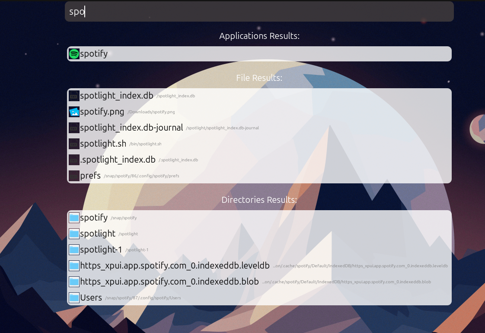

## 🛠️ Installation

1. **Clone the Repository**
   ```bash
   git clone https://github.com/Sim0Batt/Ubuntu-Spotlight
   cd Ubuntu-Spotlight
   ```

2. **Install Dependencies**  
   Make sure you have Python 3 and pip installed.
   ```bash
   pip install -r requirements.txt
   ```

3. **Run the Application**
   ```bash
   python3 indexer.py --index /home/your_user/
   python3 app.py
   ```

> 💡 *Make sure GTK and other required system libraries are installed, especially if you're running this on a minimal Linux installation.*

---

## 🧪 Testing

You can use the included `test.py` file to test individual indexing and searching components.

---

## 🗂 Project Structure

```plaintext
spotlight/
├── app.py                 # Main GUI application
├── indexer.py             # Indexing logic for files and applications
├── search.py              # Search algorithm and filtering
├── watchdog_indexer.py    # File system watching with auto-indexing
├── spotlight_index.db     # SQLite database to store indexed data
├── assets/                # Icons and other UI assets
└── test.py                # Basic script for testing components
```

---

## 🤝 Contributing

Contributions, issues, and feature requests are welcome! Feel free to open a pull request or an issue on the [GitHub repo](https://github.com/Sim0Batt/Ubuntu-Spotlight).

## 📷 Screenshots




---

## 📬 Contact

Created by **Sim0Batt** – feel free to reach out via GitHub or via e-mail **<simonebatt51@gmail.com>**!
